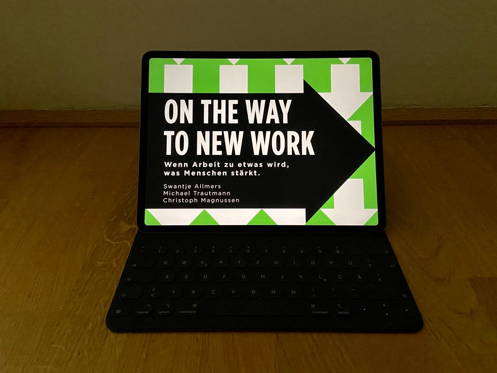

„If you do not prioritize your life, others will“. A strong and very true statement by **Greg McKeown** in **„Essentialism - the disciplined pursuit of less“** - a very nice holiday audio book with some important take-aways.

### What is it all about?
A book full of guidelines and practical tips to learn how to distinguish between essentials from non-essentials and how to pursuit the essentials in a disciplined way.

How has it affected me?
As someone who enjoys multitasking, tries to achieve best quality wherever possible and is interested in a great variety of different topics with the expectation to have solid understanding of the matter than „surface knowledge“ only, is constantly struggling in setting priorities. There are so many exciting things out there that wait to be explored and to be done. This is exactly the situation where essentialism comes in, as antidote to do everything all the time that results in stress and inner compulsion to always achieve more.

### My two main take-aways:

1) Reflect, eliminate and focus on the rest: It takes energy to review the individual priorities regularly and to take actions in case of an imbalance. A central question is „what is really important / essential for being happy and feeling good?“. Once the essential areas are identified, the rest can be deprioritized that also goes hand-in-hand with accepting the tradeoffs.
Based on this take-away, I have reviewed my priorities and goals and have updated my Kanban-based yearly planner by removing all non-essential activities (or at least dropping them to the parking lot ;) ). „Less is more“ results in a concise list of topics, but the topics listed are of exceptional value and well aligned with my mid-term priorities and goals. 

2) Pause and think before saying „yes“: It happens more than once in a time that I am caught in activities that I did neither select nor enjoy or have time for. It just happened because I did say „yes“ too promptly without considering the impact. 
An important learning is to slow down the decision making process and to commit only to those activities that I have deliberately chosen. In other words, I have to learn to say „no“. This requires courage, courage to overcome the fear of missing out and the fear of disappointing someone. Important in this context is to say „no“ in a polite and graceful way, a good „no-repertoire“ certainly helps.

