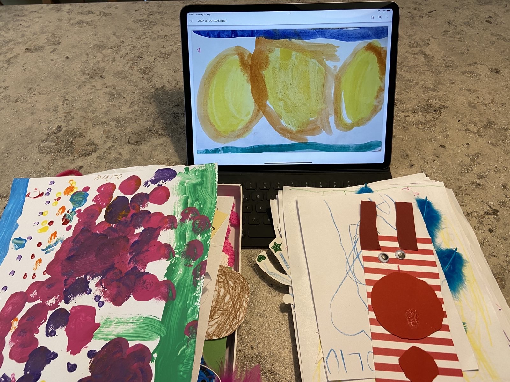

I have recently listened to the audio book „Begleiten statt verbieten. Als Familie kompetent und sicher in die digitale Welt“ by Leonie Lutz and Anika Osthoff. It is about how to raise kids in the digital age, how to teach media literacy and how to make kids aware on the opportunities but also risks in navigating through the digital world.

### What is in for me?
The book is super helpful for my endeavour to prepare my kids for the digital world. It offers lots of helpful tips and tricks how to best support kids on their journey to become media literate. 

In the following a selection of activities that I have tested with my 4-year old to best accompany her on her first steps into the digital world:
* Taking photos with the smartphone from the surroundings and editing them to teach how easily photos can be manipulated.
* Scanning her paintings, adding notes and archiving them in her cloud-based folder to teach how the tablet can be used to create a digital art collection.
* Utilizing apps for educational purposes, like Flora Incognita for identifying plants, to teach how to use apps for expanding knowledge. 
* Utilizing kids safe search engines, like fragFINN.de, as soft start for working with search engines.
* Keeping passive entertainment and screentime at a minimum, but in case to use curated kids‘ channels without ads and in-app purchases and without automatic back-to-back streaming like the ZDFtivi-app. Although she is watching kids series only, I also showed her how she can pause or stop the streaming on her own in case she sees something irritating and no parent is sitting next by.

These first steps are pretty simple, but I assume a good and soft start into the digital world. The real challenge starts when the kids are entering school and they get their first devices. Media literacy becomes very important then, to sensitive them on the great potential of being part of the digital world, but also on the risks that come along. 

